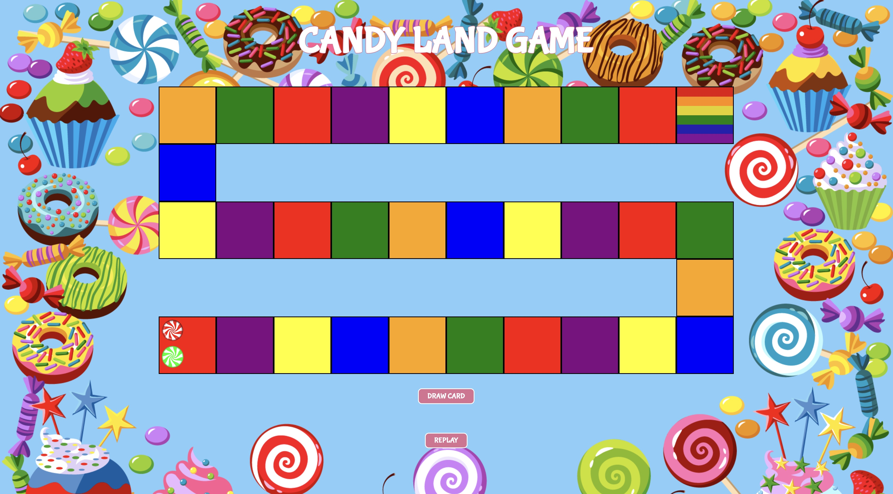

# Candy-Land

General Assembly Unit 1 project developed utilizing HTML, CSS and JavaScript.

## Date: 1/23/2023

### By: Joshua Jumelet

[LinkedIn](www.linkedin.com/in/joshua-jumelet-155a13251) |
[GitHub](https://github.com/joshjumelet) |
[Trello](https://trello.com/b/AFHwL7eK/candy-land-project-board) |
[Surge](https://candy-land-game.surge.sh/)

---

### Candy Land is a basic racing board game developed by Hasbro. The game follows the storyline of finding King Kandy the lost king of Candy Land. Players race and navigate through a woven gameboard of color coded spaces. Players goal is to reach the last square and arrive at King Candy. Each player takes turns drawing from a deck of color coded cards indicating the color of the space a player will take next.

---

### _Technologies Used_

- HTML
- CSS
- JavaScript

---

### _Getting Started_

#### Game Start is determined by the youngest player going first. Players will then alternating back and forth by selecting the draw card button next to the deck of cards. The cards will indicate the space a player takes. Players progress through the board until the first player to arrive on the final space is determined. This player wins!

---

### _Candy Land Inspiration_

##### Candy Land Game Board:

##### Candy Land Cards & Characters:

### _Candy Land Final Product_

##### Final Game Board Design:

## 

### _Future Updates_

- [ ] Animation to show character movement.
- [ ] High Resolution integrated game board.
- [ ] High Resolution cards w/ drawing animation.
- [ ] NPC interactions throughout the board that activate when player is nearby.

---

### Credits

##### Images: [Bing Search](https://www.bing.com/images/feed?form=Z9LH)

##### Fonts: [Google Fonts](https://fonts.google.com/)

##### Resource: [MDN Web Docs](https://developer.mozilla.org/en-US/)

##### Markdown Cheatsheet: [GitHub](https://github.com/joshjumelet/u1_hw_markdown)
